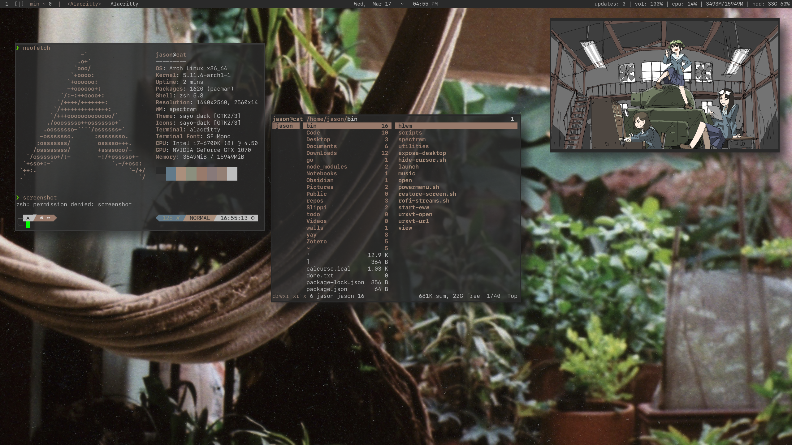
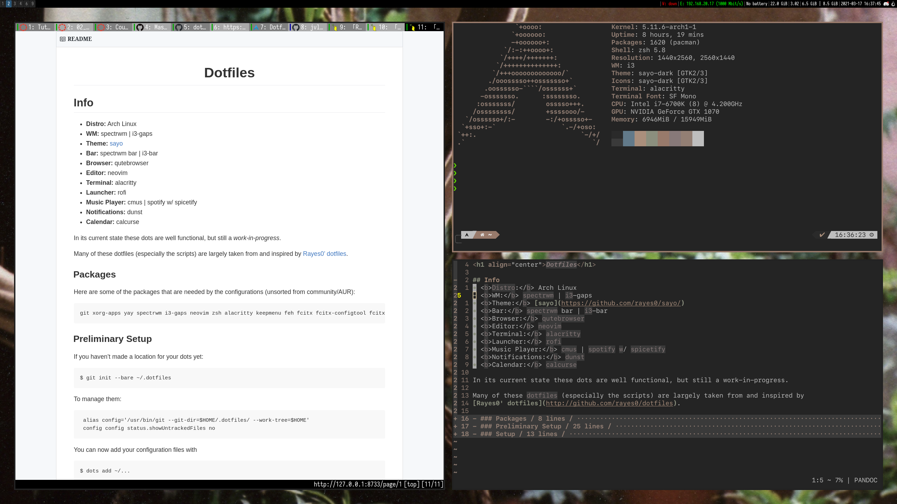

<h1 align="center">Dotfiles</h1> 

## Info
- <b>Distro:</b> Arch Linux 
- <b>WM:</b> spectrwm (daily driver) | i3-gaps
- <b>Theme:</b> [sayo](https://github.com/rayes0/sayo/)
- <b>Bar:</b> spectrwm bar | i3-bar
- <b>Browser:</b> qutebrowser
- <b>Editor:</b> neovim
- <b>Terminal:</b> alacritty
- <b>Launcher:</b> rofi
- <b>Music Player:</b> cmus | spotify w/ spicetify
- <b>Notifications:</b> dunst
- <b>Calendar:</b> calcurse
- <b>Font:</b> SF Mono | Iosevka

### the new and bold *spectrwm*


### tried and true *i3-gaps*


In its current state these dots are well functional, but still a *work-in-progress* in adjustment.

Some of these files (*sayo theme, some scripts & configuration*) are taken from and inspired by
[Rayes0' dotfiles](http://github.com/rayes0/dotfiles).

### Packages
 
Here are some of the packages that the configuration uses (unsorted from community/AUR):

```
xorg-xset spectrwm i3-gaps neovim zsh alacritty keepmenu feh fcitx fcitx-configtool fcitx-mozo greenclip weechat calcurse discord ranger reflex-curses youtube-dl mpv dunst qutebrowser rofi rofi-greenclip pulseaudio pulseaudio-utils pavucontrol spotify spicetify ytfzf-git zathura ttf-icomoon-feather ttf-material-design-icons ttf-typicons powerline-fonts powerline-common picom-ibhagwan-git npm nerd-fonts-Iosevka nerd-fonts-sf-mono deluge-gtk ahoviewer
```

