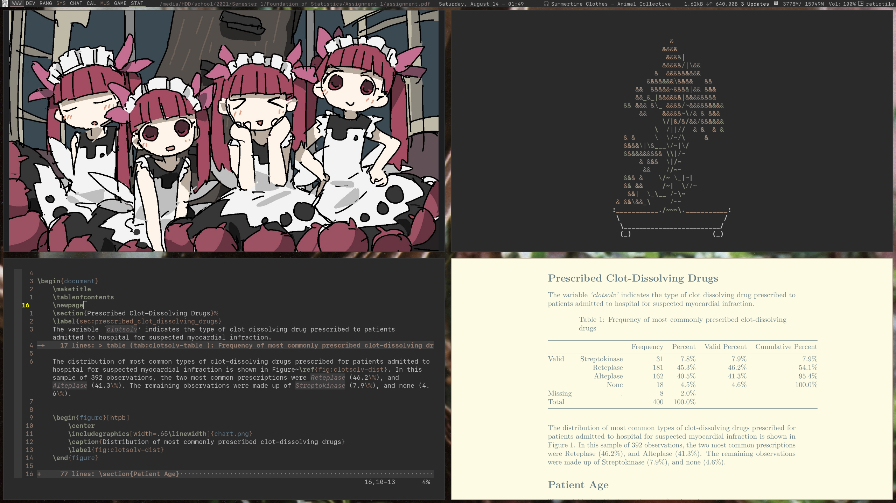
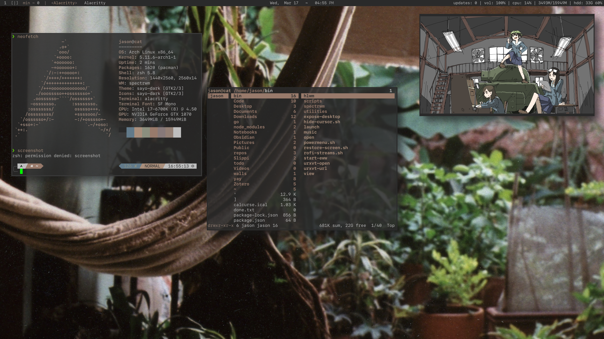

<h1 align="center">Dotfiles</h1> 

## Info
- <b>Distro:</b> Arch Linux 
- <b>WM:</b> qtile / spectrwm 
- <b>Theme:</b> [sayo](https://github.com/rayes0/sayo/)
- <b>Browser:</b> qutebrowser
- <b>Editor:</b> neovim w/ nvim-lsp
- <b>Terminal:</b> uxterm
- <b>Shell:</b> fish
- <b>Launcher:</b> rofi
- <b>Music Player:</b> spotify / cmus
- <b>Notifications:</b> dunst
- <b>Font:</b> SF Mono

### qtile

### spectrwm

