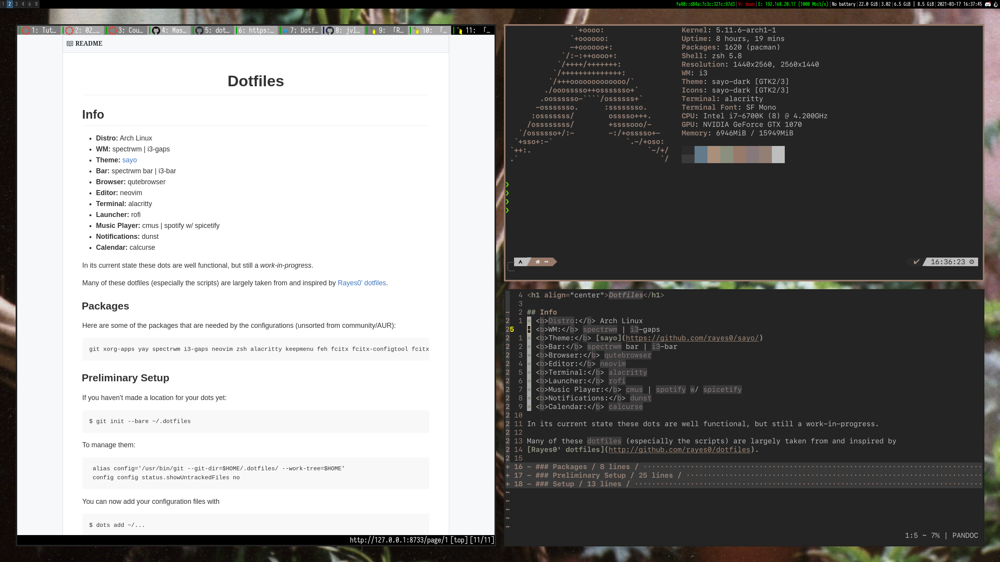
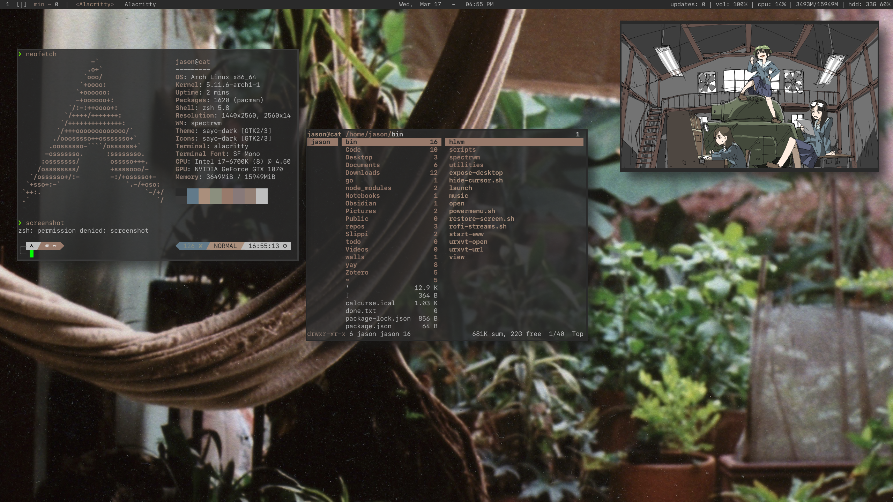

<h1 align="center">Dotfiles</h1> 

## Info
- <b>Distro:</b> Arch Linux 
- <b>WM:</b> spectrwm | i3-gaps
- <b>Theme:</b> [sayo](https://github.com/rayes0/sayo/)
- <b>Bar:</b> spectrwm bar | i3-bar
- <b>Browser:</b> qutebrowser
- <b>Editor:</b> neovim
- <b>Terminal:</b> alacritty
- <b>Launcher:</b> rofi
- <b>Music Player:</b> cmus | spotify w/ spicetify
- <b>Notifications:</b> dunst
- <b>Calendar:</b> calcurse

### tried and true *i3-gaps*


### the new and bold *spectrwm*



In its current state these dots are well functional, but still a *work-in-progress*. 

Many of these dotfiles (*sayo, scripts, configurations*) are largely taken from and inspired by
[Rayes0' dotfiles](http://github.com/rayes0/dotfiles).

### Packages
 
Here are some of the packages that are needed by the configurations (unsorted from community/AUR):

```
git xorg-apps yay spectrwm i3-gaps neovim zsh alacritty keepmenu feh fcitx fcitx-configtool fcitx-mozo greenclip weechat calcurse discord ranger reflex-curses youtube-dl mpv dunst qutebrowser rofi rofi-greenclip pulseaudio pulseaudio-utils pulseaudio-alsa pavucontrol spotify spicetify ytfzf-git zathura ttf-icomoon-feather ttf-inconsolata ttf-liberation ttf-material-design-icons ttf-typicons powerline-fonts powerline-common picom-ibhagwan-git openssl npm nerd-fonts-Iosevka nerd-fonts-sf-mono dust deluge-gtk 
```


### Preliminary Setup

If you haven't made a location for your dots yet:
```
$ git init --bare ~/.dotfiles
```

To manage them:
```
 alias config='/usr/bin/git --git-dir=$HOME/.dotfiles/ --work-tree=$HOME'
 config config status.showUntrackedFiles no
```

You can now add your configuration files with 
```
$ dots add ~/...
```


To apply this to a new machine, you can clone and force checkout the branch:
```
dots checkout -f
```


### Setup

We need [vim-plug](https://github.com/junegunn/vim-plug) for our neovim configuration:
```
curl -fLo ~/.vim/autoload/plug.vim --create-dirs \
    https://raw.githubusercontent.com/junegunn/vim-plug/master/plug.vim
```

Then we can install our plugins:
```
$ nvim +PlugInstall
```


